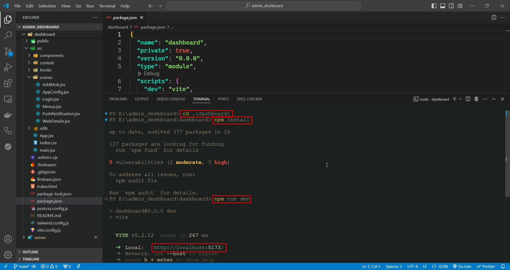
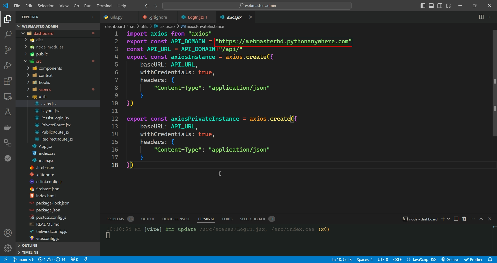
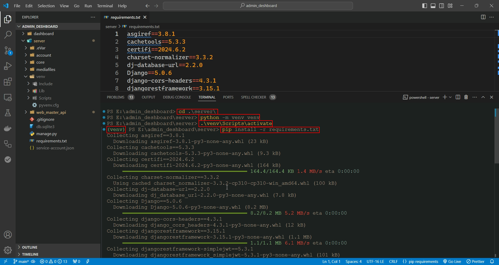
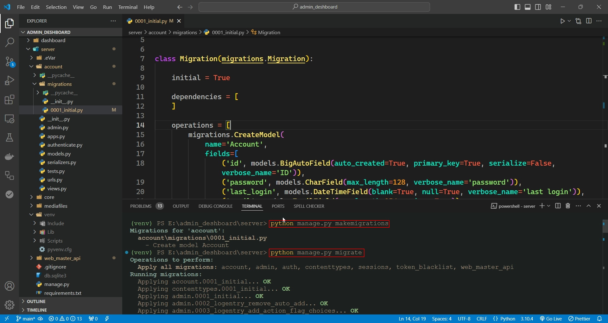
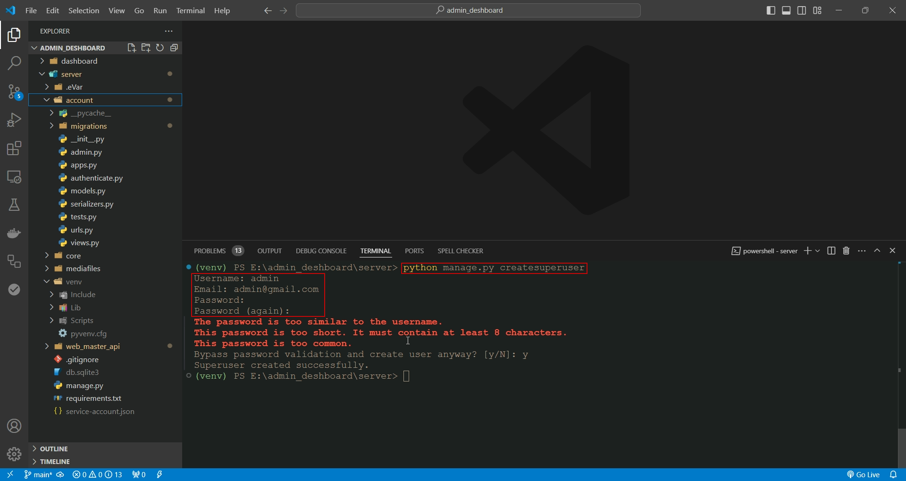
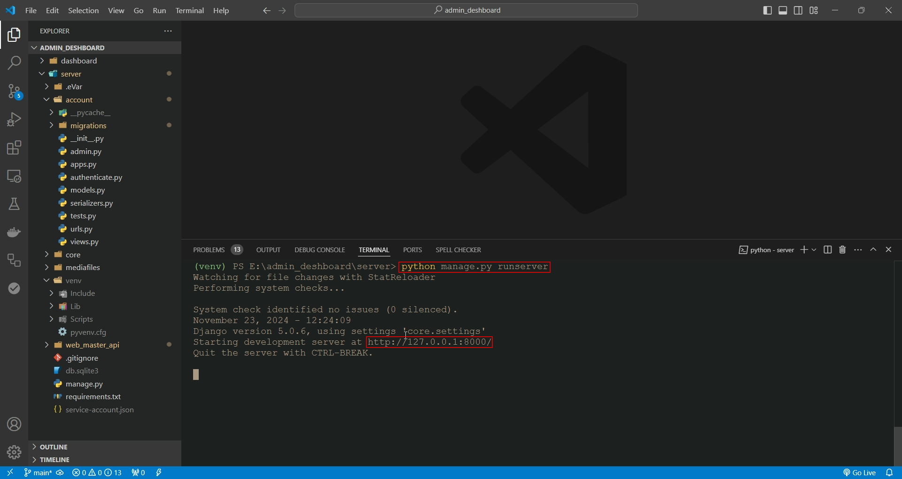
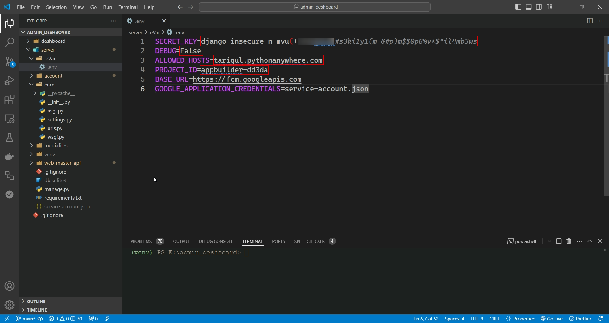

# How to run Admin Panel?

## Prerequisites:

- Python 3.6+
- Node.js and npm (or yarn)

## Running the Frontend:

1. **Open this project any IDE (Ex.vscode)**

2. **Navigate to project directory:**

   - `cd .\dashboard\`

3. **Install dependencies:**

   - `npm install`

4. **Start the React development server:**

   - `npm run dev`

   

Frontend should now be running at http://localhost:5173/

## Frontend Customization (Local Machine):

1. Go to `dashboard->src->utils->axios.jsx ` and give your local url for development `API_DOMAIN`

   

## Running the Backend(Local Machine):

1. **Open this project any IDE (Ex.vscode)**

2. **Navigate to project directory:**

   - ` cd .\server\`

3. **Create a virtual environment and activate it:**
   **For Windows**

   - `python -m venv venv`
   - `venv\Scripts\activate`

   **For Linux**

   - `python3 -m venv venv`
   - `source venv/bin/activate`

4. **Install dependencies:**

   - `pip install -r requirements.txt`

   

5. **Run migrations:**

   - `python manage.py migrate`
   - For linux `python3 manage.py migrate`

   

6. **Create a superuser (accessing Django admin):**

   - `python manage.py createsuperuser`
   - For linux `python3 manage.py createsuperuser`

   

7. **Run the Django development server:**

   - `python manage.py runserver`
   - For linux `python3 manage.py runserver`

   

Your Django backend should now be running at http://127.0.0.1:8000/.

## Backend Customization (Local Machine):

1. First download json from firebase than rename json as `service-account.json`
2. Replace project `service-account.json` with your `service-account.json`
3. Go to your `service-account.json` and copy `project_id`
4. Than go to `server->.eVar->.env ` and replace the `project_id`
5. For development you need to set `debug=True`
6. For host by yourself please replace hostname what you want to

   
