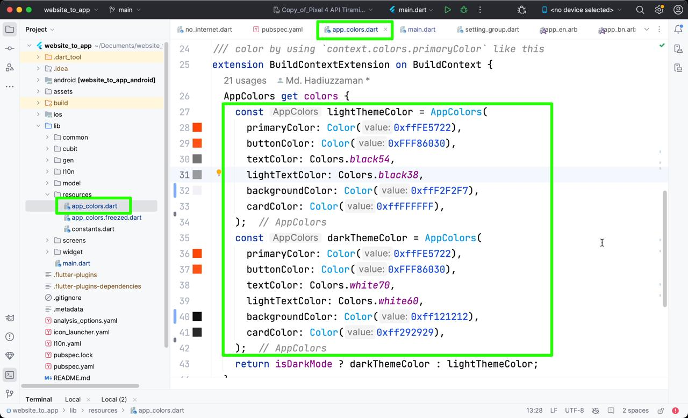
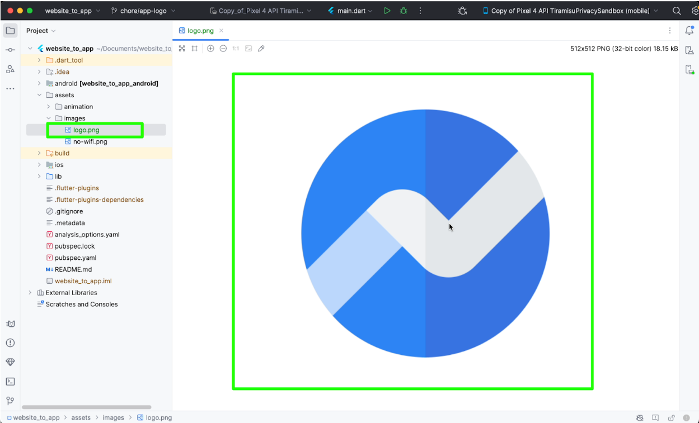
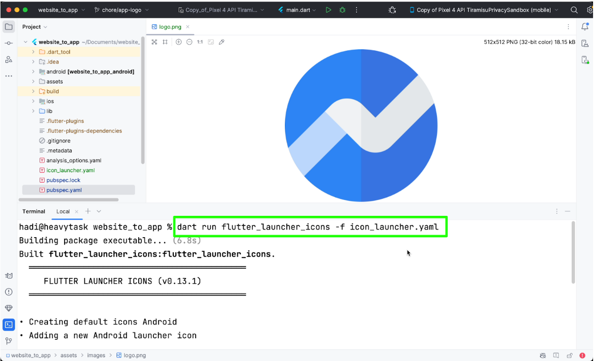

# Customization
You may Customize as your requirements


## Change App Color
To change the app's color scheme
   - Goto resources directory.
   - Open app_color.dart then change the color




## Change app Logo
To replace the app logo you can follow these steps:

1. **Replace `logo.png` in Assets:**
   - Navigate to the `assets/images` directory in your Flutter project.
   - Delete the existing `logo.png` file.
   - Paste your own logo file and ensure it is named `logo.png`.

   

2. **Change app icon:**
   - Open your terminal or command prompt.
   - Run the following command to update the app launcher icon using:
   ```
   dart run flutter_launcher_icons -f icon_launcher.yaml
   ```
   

3. **Verify Changes:**
   - Once the command has been executed successfully, verify that the new launcher icon has been applied to your app.

