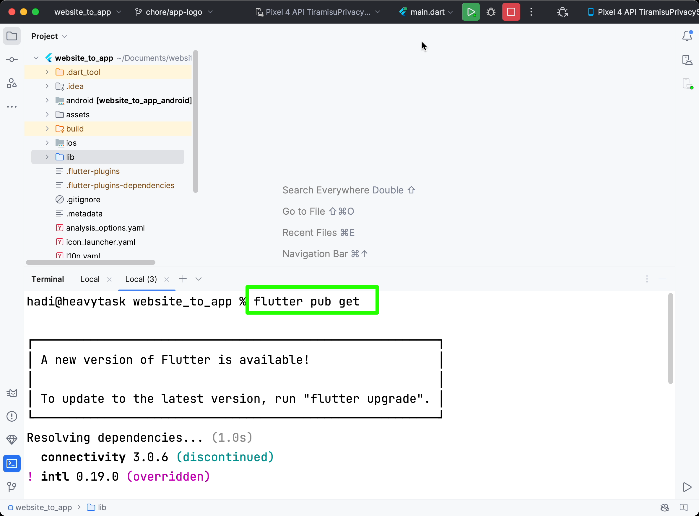
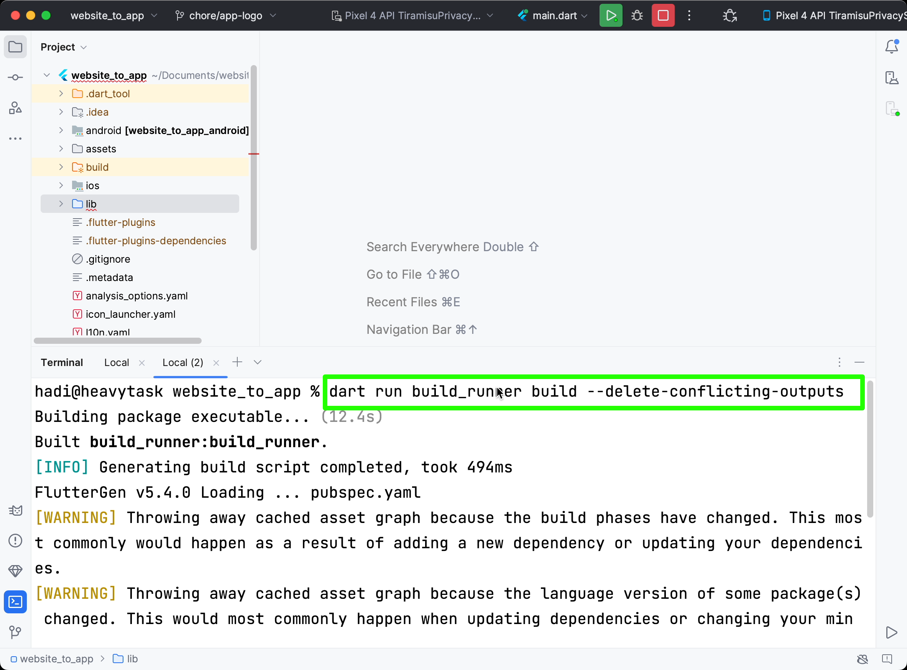
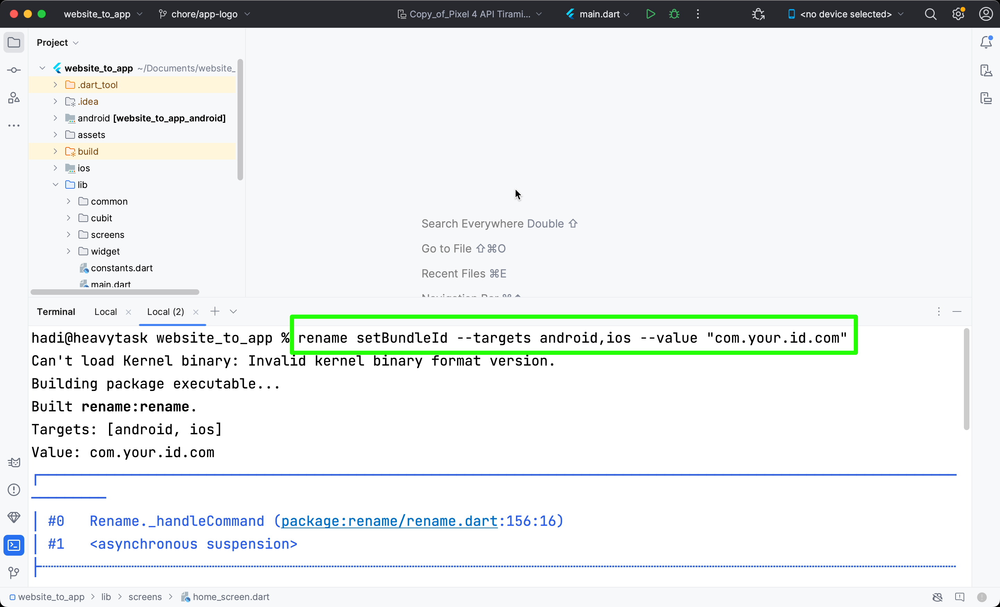
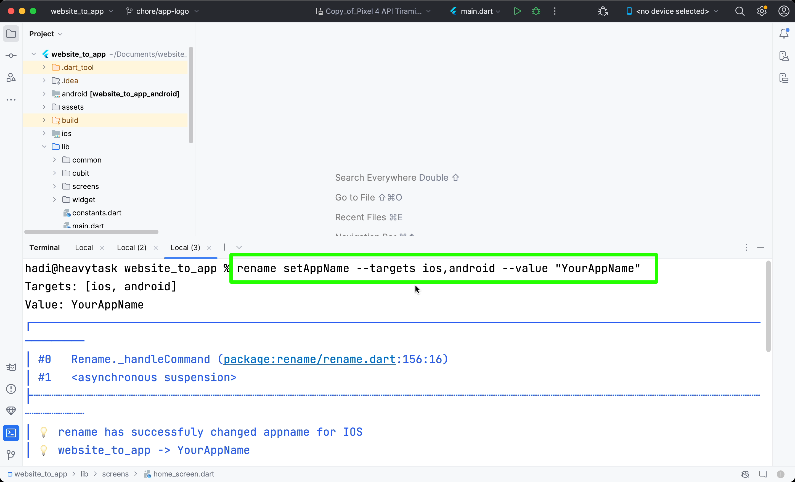

# How to run app?

## Run an existing flutter project on IDE

To run an existing Flutter project on an Integrated Development Environment (IDE) like Android Studio or Visual Studio Code, follow these general steps:

1. **Open the IDE:**
   - Launch Android Studio or Visual Studio Code on your computer.

2. **Open the Flutter Project:**
   - In Android Studio: Go to File > Open and navigate to your Flutter project directory. Select the web—master folder and open it.
   - In Visual Studio Code: Open the folder containing your Flutter project.

3. **Get Dependencies:**
   - Open your terminal or command prompt.
   - Navigate to your Flutter project directory.
   - Paste the following command, this command fetches and retrieves the dependencies specified in your pubspec.yaml file. 
     ```
     flutter pub get
     ```
   

4. **Generate Files:**
   - After getting dependencies, you might need to generate necessary files, using this command.
   ```
   dart run build_runner build --delete-conflicting-outputs
   ```
   

5. **Run the Project:**
   - In Android Studio:
     - Click on the green play button (Run) in the toolbar.
     - Select the target device (emulator or connected device) from the device dropdown menu.
     - Click on the Run button to build and run the Flutter project on the selected device.
   - In Visual Studio Code:
     - Press `F5` or go to the Run menu and select "Start Debugging" to build and run the Flutter project.
     - Select the target device from the dropdown menu if prompted.
     - Alternatively, you can run the project from the terminal by executing the command `flutter run`.

By following these steps, you should be able to successfully run your existing Flutter project on your preferred IDE. Make sure to troubleshoot any errors that may arise during the build process or runtime execution.

## Change package name:
To change the package name in a Flutter project follow these steps:
- Open your terminal or command prompt.
- Past this following command into your terminal.
   ```
   rename setBundleId --targets android,ios --value "com.your.id.com"
   ```
   

## Change app Name
To change the app name in a Flutter project using the `rename` tool, you would typically follow these steps:

- Open your terminal or command prompt.

- Paste the following command into your terminal and replace `"YourAppName"` with the desired name for your app, this command will updates the app name in both iOS and Android app.
     ```
     rename setAppName --targets ios,android --value "YourAppName"
     ```
   


## Change Base URL
To change the value of the `webURL` variable in the `constant.dart` file located in the `lib/resources` directory of your Flutter project, you can follow these steps:

- Open your Flutter project in your preferred code editor.

- Navigate to the `constant.dart` file located in the `lib/resources` directory.

- Locate the `webURL` variable in the file, and replace by your URL.


