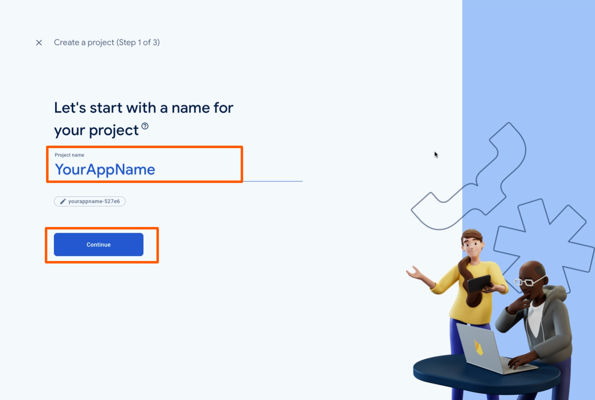
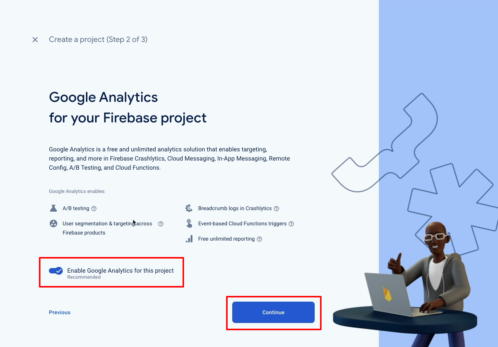
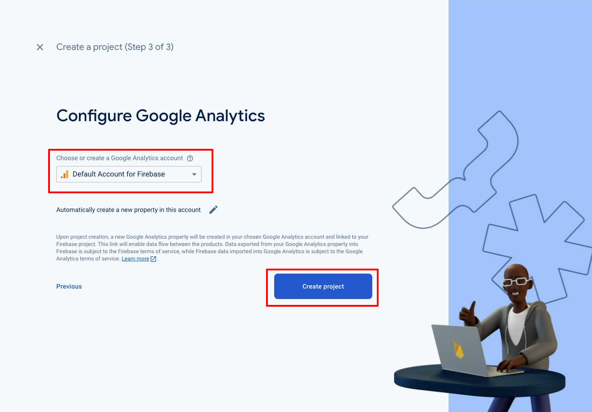
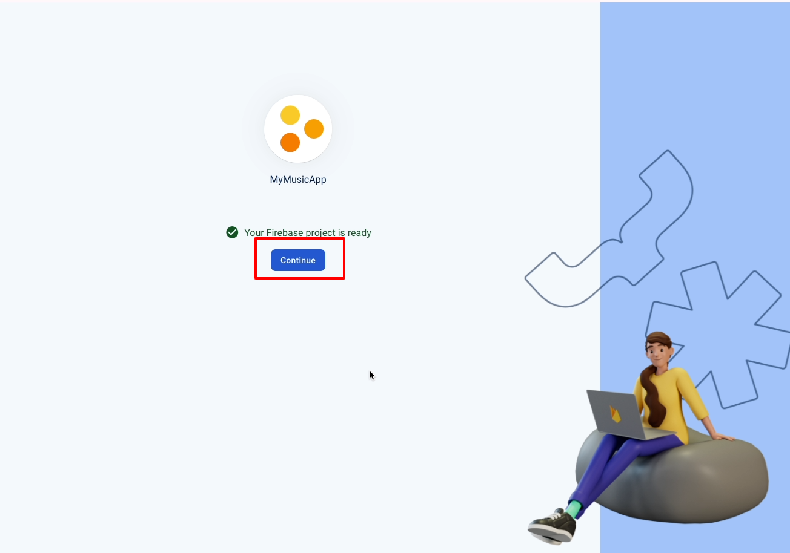
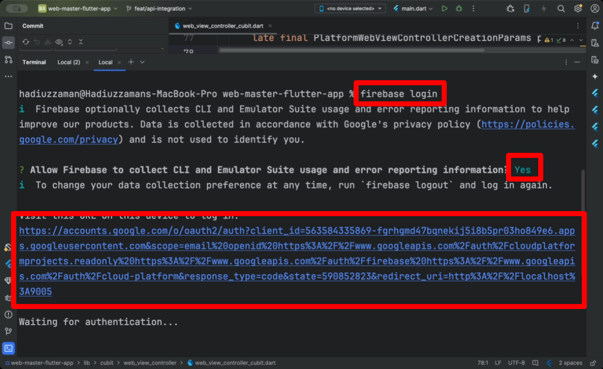
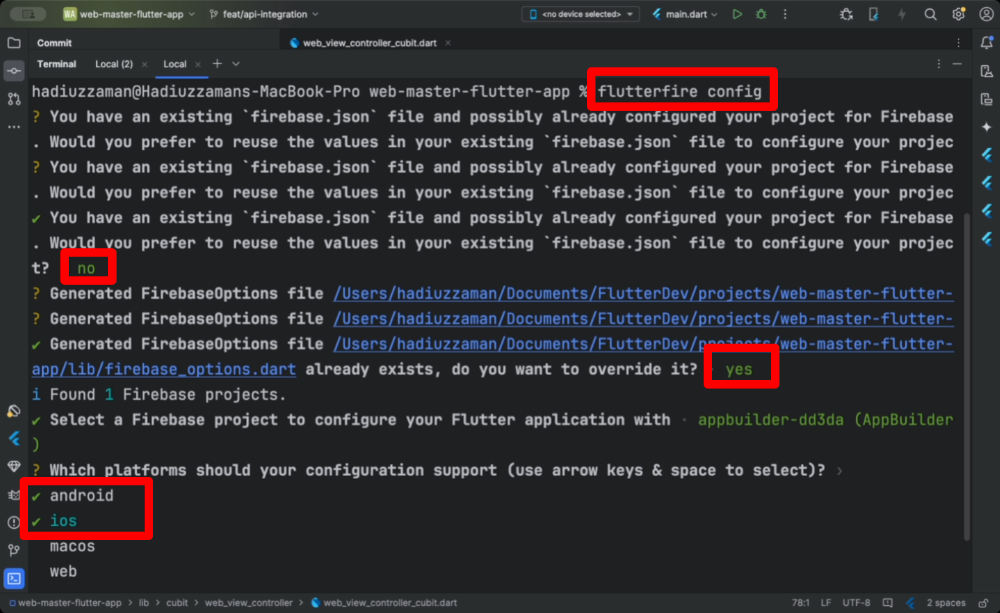

# Firebase configuration

- Open the firebase [console](https://console.firebase.google.com/) and create a new project

  

- Enable google analysis if you want and press continue

  

- Choose Default Account for firebase from dropdown menu then press create project button

  

- Wait few moments to create the project and press continue

  

  - Our Firebase project is ready to be connected with your app. Let's follow a few more steps to establish the connection!

- Go to your Android Studio, open the terminal, and paste the following command: 'firebase login'. After successfully logging in through the browser, you are ready to configure the Firebase projects for your Flutter project.

  

- Paste "flutterfire configure" this command on the terminal and configure your project like below

  

:::tip
Ensure all setps do accordingly.
