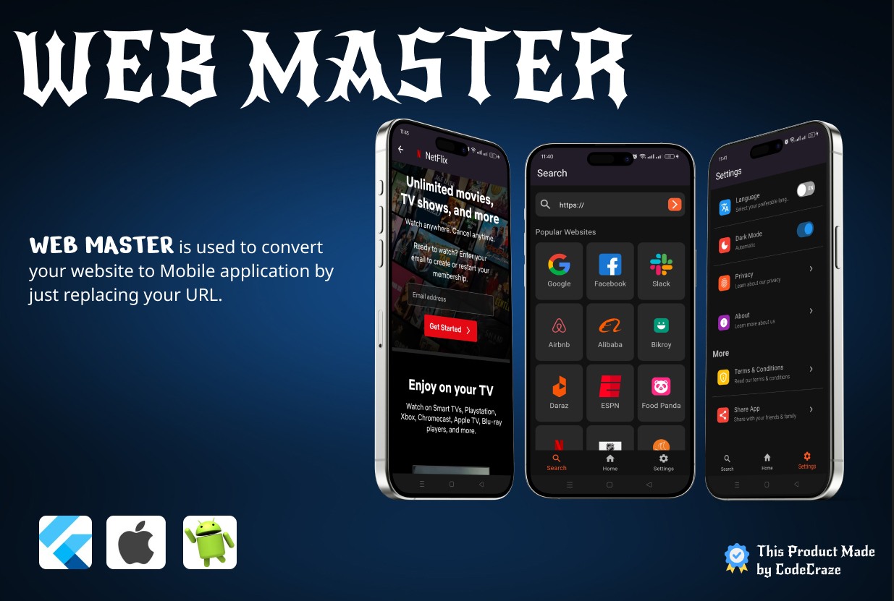

# Introduction

Introducing our innovative Flutter application - a versatile solution designed to effortlessly convert any website into a fully-functional Flutter app. With intuitive tabs for quick access to vendor-owned websites, seamless search functionality, and a comprehensive settings menu offering customization options like multi-language support, dark mode, and privacy settings, our app redefines the way users interact with web content. Whether it's accessing favorite sites on the go or tailoring the app experience to individual preferences, our solution delivers unparalleled convenience and flexibility. Experience the future of web-to-app conversion with our cutting-edge Flutter application, now available on Codecanyon.

## Overview:

You have developed a Flutter application that allows users to convert any website into a Flutter app. The app consists of several key features:

1. Home Tab: Displays vendor-owned websites, providing users with quick access to these sites.

2. Search Tab: Users can search for websites to be converted into Flutter apps. Upon searching, the app displays the searched website as an app.

3. Settings Tab: This tab includes various settings for customization and user preferences, such as:
   - Multiple languages: Users can select their preferred language for the app interface.
   - Dark Mode: Option to switch between light and dark mode for optimal viewing experience.
   - Privacy: Settings related to user privacy and data handling.
   - About: Information about the app, its developers, and version details.
   - Terms & Conditions: Access to the terms and conditions governing app usage.
   - Share App: Allows users to share the app with others via various platforms.

By offering these features, your Flutter app provides users with a convenient way to access their favorite websites as standalone applications, while also giving them control over customization options and access to important information through the settings tab. This comprehensive functionality makes your app a valuable asset for users seeking flexibility and convenience in accessing web content.