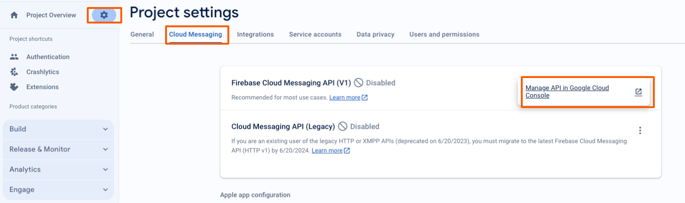
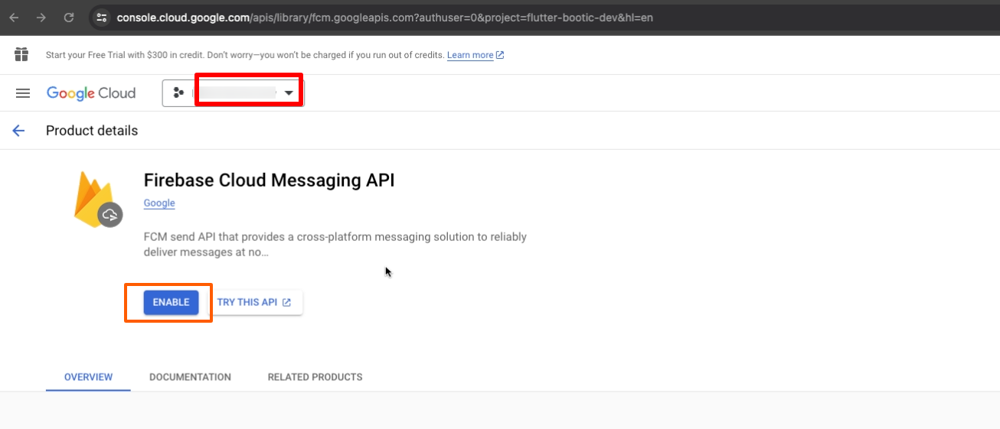
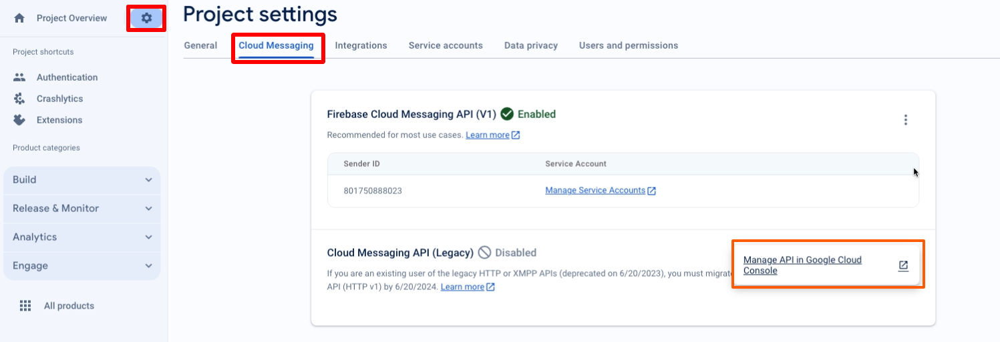
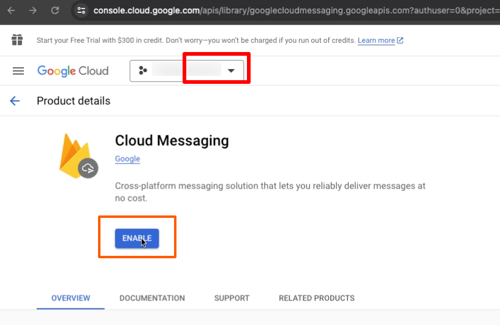
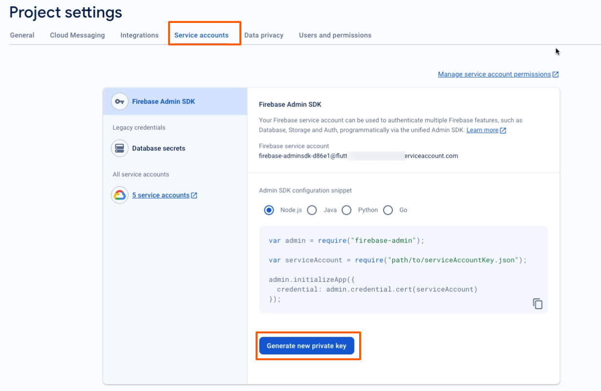

# Push Notification

- Open the Firebase Console and select your project. Click the Settings icon on the left sidebar and choose Cloud Messaging.

- Click on the Manage API in Google Cloud Console link, which opens the Google Cloud Console in a new tab. Ensure the Firebase Cloud Messaging API is enabled. If it's not, enable it

  

- Ensure the Firebase Cloud Messaging API is enabled. If it's not, enable it

  

- Return to the Firebase Console and select the Manage API in Google Cloud Console link again to confirm that the Cloud Messaging option is enabled.

  

- Go back on the Firebase Console and click 'Service Account' button and click on the 'Generate new private key' button

  

- Click Generate Key to download the service account JSON file to your local machine.

  
